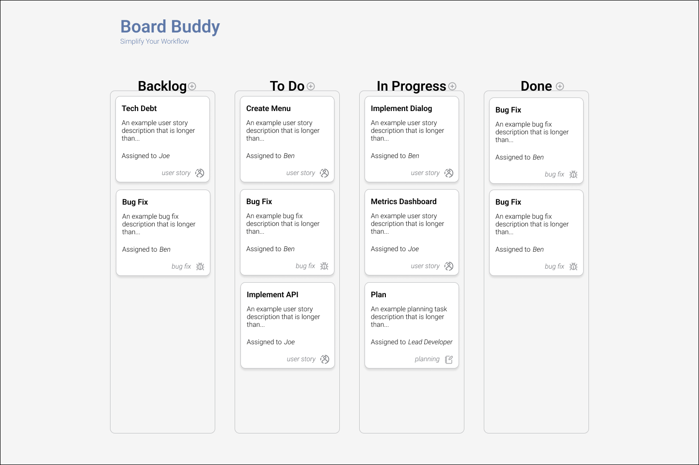

# Board Buddy

This is the git repository fo Board Buddy. A simplified kan ban board, intended to minimize complicated project management tasks.




## Running Locally

This can be run locally, with `npm run dev`, but you will need localhost env file:

```env
# OAuth for google on localhost
AUTH_GOOGLE_ID=<from console.cloud.google.com>
AUTH_GOOGLE_SECRET=<from console.cloud.google.com>
AUTH_GOOGLE_CALLBACK="http://localhost:5173/signin/providers/google/callback"

# Set to your mongodb url
MONGODB_URI=mongodb://localhost:27017/board-buddy

APPLE_CLIENT_ID=<for apple, only if deploying, locally can be anything>
APPLE_CLIENT_SECRET=<from apple>

# Keycloak is used even when OAuth is used, set the values below to your keycloak values
OAUTH_VALIDATION_URL=http://localhost:8080/auth/realms/boardbuddy/protocol/openid-connect/userinfo
OAUTH_CLIENT_URL=http://localhost:8080/auth/realms/boardbuddy
KEYCLOAK_ADMIN_API=http://localhost:8080/auth/admin/realms/boardbuddy
KEYCLOAK_REALM=boardbuddy
KEYCLOAK_CLIENT_ID=local
KEYCLOAK_CLIENT_SECRET=<your keycloak secret>
```
